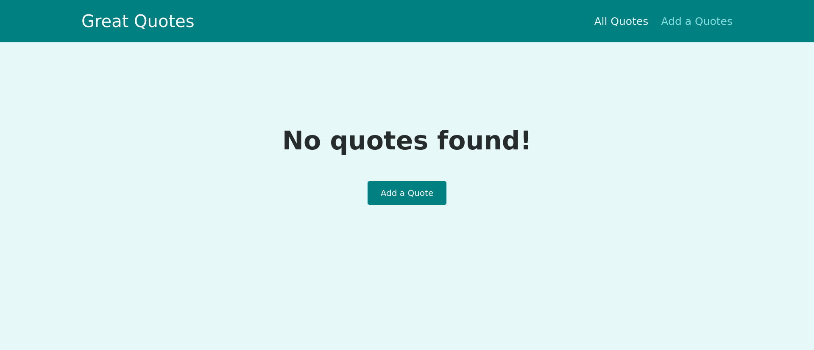
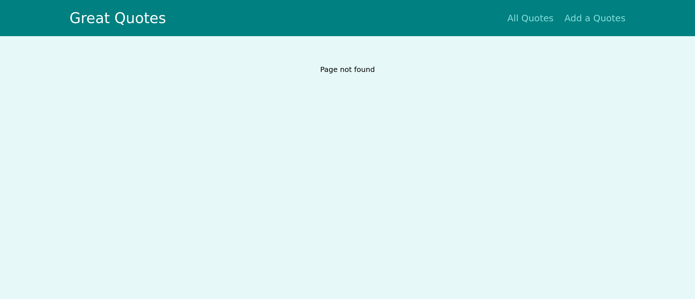
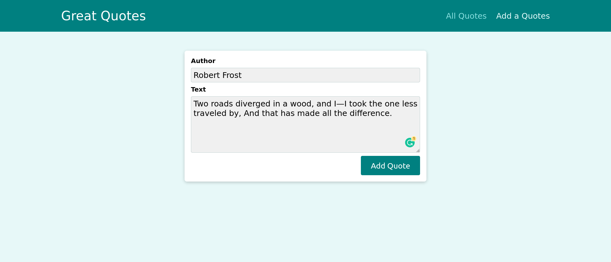
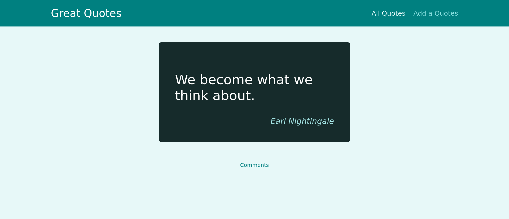
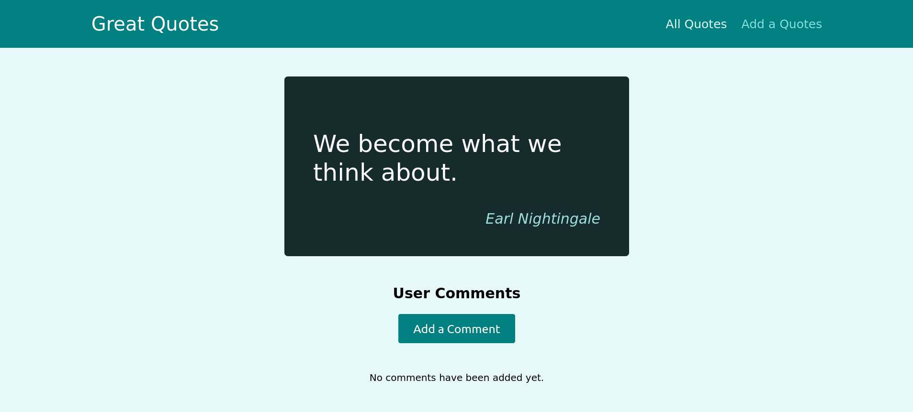
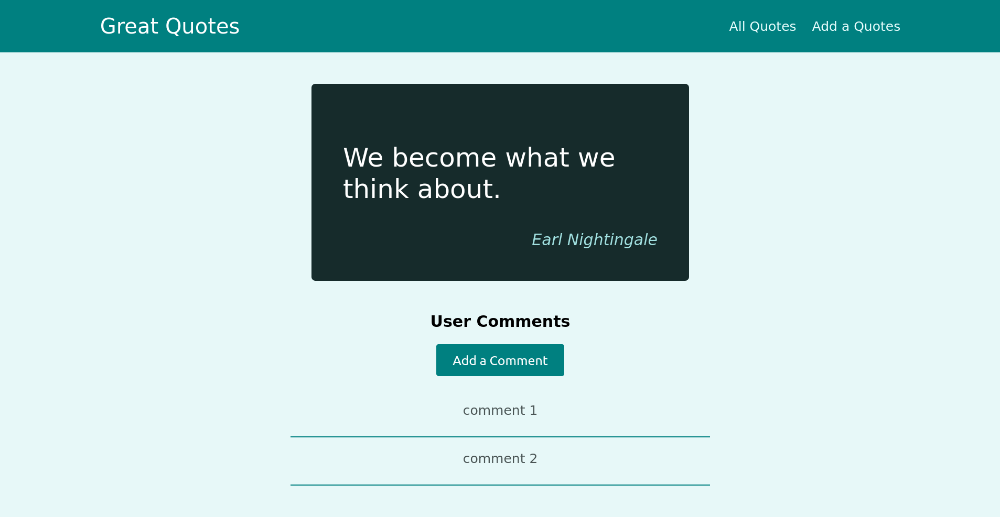
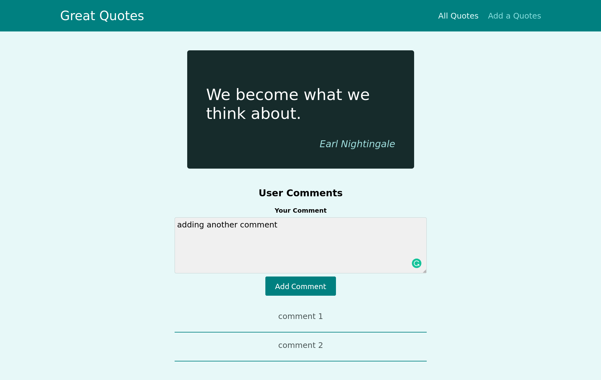

# React Routing

In this application, I made a simple quotes application, that shows quotes and give a feature to create new quotes. Add comments to quotes etc.

In this application, the following concepts are covered.
- Working with Query Parameters
- Preventing Unwanted Route Transitions with the "Prompt" Component
- Programmatic navigation
- handling 404 Not Found routes
- Nested routes
- Sending & Getting Data via Http
- react hooks
- React.Fragment
- Reducers

### Screen shots

home page

Handling page not found.

Creating new quote.

Viewing quote.

Viewing quote with comments.

Adding comment in quote.

